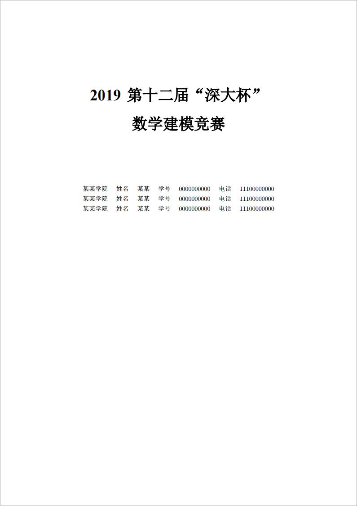
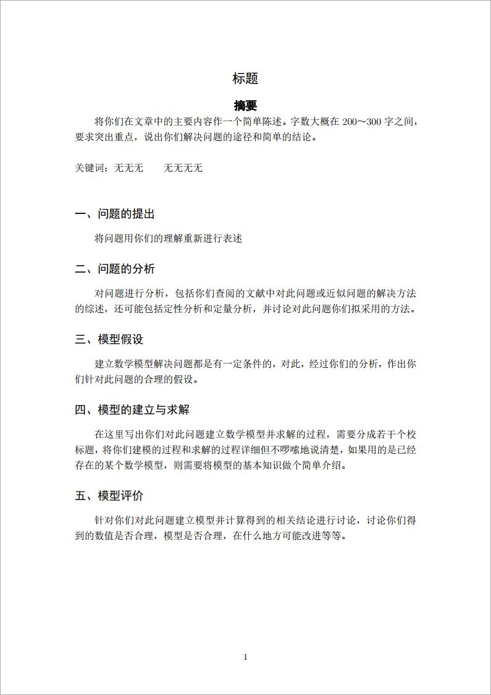

# SZUMCMThesis

## 简介

此模板是深大杯数学建模竞赛LaTeX论文模板

## 使用方法

* 请使用XeLaTeX作为编译器
* 请使用TeX Live套装 而不要使用 CTeX套装
* 有任何问题请在[Issues](https://github.com/AirManH/SZUMCMThesis/issues)中提出

## 预览

## 文件说明

    ├──img/    预览图目录
    ├──ref/    参考文件所在目录
    └──src/
       └──main.tex    LaTeX模板

## 说明

* 该LaTeX模板参照[深大内部网公文通](https://www1.szu.edu.cn/board/view.asp?id=366418)处提供的模板进行制作，尽力做到还原。
* 由于我是一个LaTeX新手，为了还原word文档的效果，使用了很多不美观的排版方式，代码也不够简洁，欢迎大佬指出与完善。